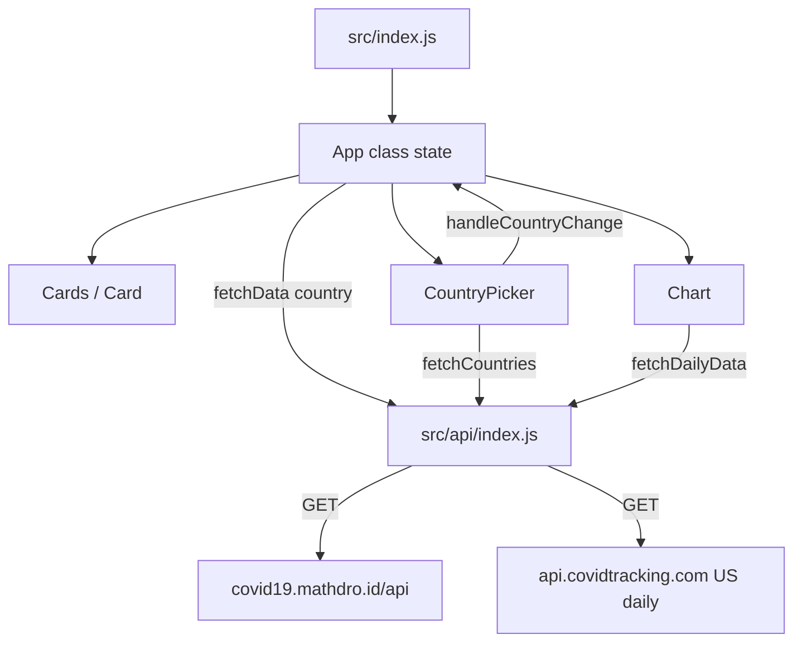

# Code Analysis Report — arpitsaxena-gl/project_corona_tracker

**Run ID:** `20260720T182332_fr2tvm`  
**Agent:** code-analyser-agent  
**Base branch:** `master` @ `c6b004c2a7`  
**Scope:** Full application source via GitHub MCP (cloud OAuth). Local TARGET_WORKSPACE not used for app source.

---

## 1. Detected Stack

| Dimension | Detection | Confidence | Evidence |
|-----------|-----------|------------|----------|
| **Languages** | JavaScript (ES2018+), JSX, CSS Modules | high | `.js`/`.jsx` files; `parserOptions.ecmaVersion: 2018` in `.eslintrc.js`; CSS modules (`*.module.css`) |
| **Frontend** | React 16.13 (Create React App) | high | `react`/`react-dom`/`react-scripts@3.4.1` in `package.json`; `ReactDOM.render` in `src/index.js` |
| **UI library** | Material-UI v4 | high | `@material-ui/core@^4.9.7`; imports in Cards/Card/CountryPicker |
| **Charts** | Chart.js 2 + react-chartjs-2 | high | `chart.js@^2.9.3`, `react-chartjs-2@^2.9.0`; `Line`/`Bar` in `Chart.jsx` |
| **HTTP client** | axios 0.19.2 | high | `axios` import in `src/api/index.js` |
| **Backend** | None (SPA only) | high | No server code; consumes third-party COVID REST APIs |
| **Data layer** | External REST JSON (no local DB/ORM) | high | Hard-coded URLs to mathdro + covidtracking APIs |
| **Build/deploy** | CRA (`react-scripts`); npm lockfile | high | `package.json` scripts; `package-lock.json` present; `.github/` funding only (no CI workflows opened) |
| **Testing** | Jest via CRA + Testing Library (declared, unused) | medium | `@testing-library/*` in deps; `npm test` script; **no `*.test.js` / `__tests__` files observed** in blueprint or src listing |

### Per-file roles

| Path | Role |
|------|------|
| `src/index.js` | Entry point — mounts `<App />` |
| `src/App.js` | Container / state owner (class component) |
| `src/App.module.css` | App layout styles |
| `src/api/index.js` | Integration / data-access (HTTP) |
| `src/components/index.js` | Barrel re-exports |
| `src/components/Cards/Cards.jsx` | Presentational summary cards |
| `src/components/Cards/Card/Card.jsx` | Single metric card |
| `src/components/Chart/Chart.jsx` | Chart view (hooks) |
| `src/components/CountryPicker/CountryPicker.jsx` | Country select control |
| `.eslintrc.js` | Lint config (Airbnb + React) |
| `package.json` | Manifest / dependency versions |

---

## 2. Architectural Context

**Style:** Single-page React monolith (client-only). Presentation components + thin API module. Not MVC/hexagonal; closer to a simple **container/presentational** split.

**Layers observed:**
1. **Bootstrap** — `index.js`
2. **Application state** — `App` class (`data`, `country`)
3. **Presentation** — Cards, Chart, CountryPicker
4. **Integration** — `src/api/index.js` (axios → external COVID APIs)

**Separation:** Generally clean (UI does not embed HTTP). Leakage risks:
- Error objects from API are stored as `data` and passed to UI (integration errors leak into presentation shape).
- Chart mixes data-fetch (`fetchDailyData`) with rendering.
- Cards hard-codes title `"Global"` regardless of selected country (presentation/business inconsistency).

**Dependencies & wiring:**
- `App` → `fetchData`, Cards, CountryPicker, Chart
- Chart → `fetchDailyData` (independent of App country for line chart)
- CountryPicker → `fetchCountries`
- No DI; direct module imports

**Boundaries:** Public surface is the browser UI only. No auth, no backend BFF.

---

## 3. Data & State Structures

### Transient / in-memory (no persistent store)

| Structure | Location | Shape / notes | Lifecycle |
|-----------|----------|---------------|-----------|
| `App.state.data` | `App.js` | `{ confirmed, recovered, deaths, lastUpdate }` or **Error object on failure** | Mount + country change |
| `App.state.country` | `App.js` | `string` (default `''` = global) | Country picker change |
| `dailyData` | `Chart.jsx` | Array of `{ confirmed, recovered, deaths, date }` or Error | Once on Chart mount |
| `countries` | `CountryPicker.jsx` | `string[]` of country names, or Error | Once on mount |

### External API payloads (read-only)

- **mathdro** summary: nested `{ confirmed: { value }, recovered: { value }, deaths: { value }, lastUpdate }`
- **mathdro** countries list: `{ countries: [{ name }] }`
- **covidtracking** US daily: array with `positive`, `recovered`, `death`, `dateChecked`

### Caching

None. Every mount/change hits network. No invalidation strategy.

### Global mutable state

None beyond React component state. Module-level `url` constant in API module.

---

## 4. Inputs, Parameters & Contracts

### Inputs & Fields Report

#### Unit: `fetchData` (File: `src/api/index.js`)

| # | Name | Scope | Direction/Role | Data Type | Nature | Default | Array? |
|---|------|-------|----------------|-----------|--------|---------|--------|
| 1 | country | Parameter | INPUT | string \| undefined | Optional | — (falsy → global URL) | No |
| 2 | confirmed | Return object | OUTPUT | object `{ value }` | Output | — | No |
| 3 | recovered | Return object | OUTPUT | object `{ value }` | Output | — | No |
| 4 | deaths | Return object | OUTPUT | object `{ value }` | Output | — | No |
| 5 | lastUpdate | Return object | OUTPUT | string (ISO date) | Output | — | No |
| 6 | (error) | catch return | OUTPUT | Error / axios error | Output (mis-modeled as data) | — | No |

**HTTP contract:** `GET https://covid19.mathdro.id/api` or `GET .../countries/{country}` — no auth, JSON.

#### Unit: `fetchDailyData` (File: `src/api/index.js`)

| # | Name | Scope | Direction/Role | Data Type | Nature | Default | Array? |
|---|------|-------|----------------|-----------|--------|---------|--------|
| 1 | (none) | — | — | — | — | — | — |
| 2 | mapped[] | Return | OUTPUT | `{ confirmed, recovered, deaths, date }` | Output | — | Yes |

**HTTP:** `GET https://api.covidtracking.com/v1/us/daily.json`

#### Unit: `fetchCountries` (File: `src/api/index.js`)

| # | Name | Scope | Direction/Role | Data Type | Nature | Default | Array? |
|---|------|-------|----------------|-----------|--------|---------|--------|
| 1 | countries[].name | Mapped return | OUTPUT | string | Output | — | Yes |

#### Unit: `App.handleCountryChange` (File: `src/App.js`)

| # | Name | Scope | Direction/Role | Data Type | Nature | Default | Array? |
|---|------|-------|----------------|-----------|--------|---------|--------|
| 1 | country | Parameter | INPUT | string | Optional (empty = global) | `''` in state | No |

#### Unit: `Cards` / `Info` (File: `src/components/Cards/Cards.jsx`)

| # | Name | Scope | Direction/Role | Data Type | Nature | Default | Array? |
|---|------|-------|----------------|-----------|--------|---------|--------|
| 1 | confirmed | Props (destructured) | INPUT | object \| undefined | Conditional Mandatory | — | No |
| 2 | recovered | Props | INPUT | object | Mandatory when confirmed | — | No |
| 3 | deaths | Props | INPUT | object | Mandatory when confirmed | — | No |
| 4 | lastUpdate | Props | INPUT | string/date | Mandatory when confirmed | — | No |

#### Unit: `CardComponent` (File: `src/components/Cards/Card/Card.jsx`)

| # | Name | Scope | Direction/Role | Data Type | Nature | Default | Array? |
|---|------|-------|----------------|-----------|--------|---------|--------|
| 1 | className | Props | INPUT | string | Optional | — | No |
| 2 | cardTitle | Props | INPUT | string | Mandatory | — | No |
| 3 | value | Props | INPUT | number | Mandatory | — | No |
| 4 | lastUpdate | Props | INPUT | string/date | Mandatory | — | No |
| 5 | cardSubtitle | Props | INPUT | string | Mandatory | — | No |

#### Unit: `Chart` (File: `src/components/Chart/Chart.jsx`)

| # | Name | Scope | Direction/Role | Data Type | Nature | Default | Array? |
|---|------|-------|----------------|-----------|--------|---------|--------|
| 1 | confirmed | Props.data | INPUT | object \| undefined | Conditional (bar chart) | — | No |
| 2 | recovered | Props.data | INPUT | object | Conditional | — | No |
| 3 | deaths | Props.data | INPUT | object | Conditional | — | No |
| 4 | country | Props | INPUT | string | Optional (falsy → line chart) | `''` | No |

#### Unit: `Countries` / CountryPicker (File: `src/components/CountryPicker/CountryPicker.jsx`)

| # | Name | Scope | Direction/Role | Data Type | Nature | Default | Array? |
|---|------|-------|----------------|-----------|--------|---------|--------|
| 1 | handleCountryChange | Props | INPUT (callback) | function | Mandatory | — | No |
| 2 | e.target.value | Event | INPUT | string | Optional | `""` default option | No |

---

## 5. Validation Logic

Validation is minimal. PropTypes are **disabled** in ESLint (`"react/prop-types": 0`).

### Validations for `confirmed` (Cards gate)

- **Category:** Presence / required
  - **Location:** `src/components/Cards/Cards.jsx`:7–9, component `Info`
  - **Code:** `if (!confirmed) { return 'Loading...'; }`
  - **Triggered:** Always before render of cards
  - **Effect:** Soft gate — shows loading string; does **not** distinguish loading vs error vs empty

### Validations for `confirmed` (Chart bar gate)

- **Category:** Presence / required
  - **Location:** `src/components/Chart/Chart.jsx`:21–22
  - **Code:** `confirmed ? (<Bar .../>) : null`
  - **Triggered:** When `country` is truthy (bar path)
  - **Effect:** Renders nothing if missing

### Validations for `dailyData[0]` (Chart line gate)

- **Category:** Presence / required
  - **Location:** `src/components/Chart/Chart.jsx`:42–43
  - **Code:** `dailyData[0] ? (<Line .../>) : null`
  - **Triggered:** When `country` is falsy
  - **Effect:** Renders nothing if empty/invalid; **fails** if `dailyData` is an Error (not array) — indexing Error is undefined, may avoid crash but silent failure

### Validations for `country` (URL branch)

- **Category:** Conditional / presence
  - **Location:** `src/api/index.js`:7–9
  - **Code:** `if (country) { changeableUrl = \`${url}/countries/${country}\`; }`
  - **Triggered:** When country argument is truthy
  - **Effect:** Switches endpoint; **no sanitization** of country string (path injection risk low but unvalidated)

### Missing / inconsistent validation (gaps)

| Gap | Detail |
|-----|--------|
| No success-shape check after axios | Catch returns `error`; callers treat as COVID payload |
| No Array.isArray on `countries` / `dailyData` | `.map` will throw if Error returned |
| Chart prop destructure | `data: { confirmed, recovered, deaths }` throws if `data` is null/Error without those keys ⚠️ may crash on failed fetch |
| CountryPicker label vs value | Option text `"United States"` with `value=""` fetches **global**, not US |
| No allow-list for country names | Free string from select options only (OK if list trusted) |
| Cards title always "Global" | Not validated/updated when country selected |

### Conditional Dependencies

| Field | Required When | Condition |
|-------|---------------|-----------|
| `confirmed.value` / bar datasets | Conditional | `country` truthy and `confirmed` truthy |
| Line chart datasets | Conditional | `!country` and `dailyData[0]` truthy |
| Card fields | Conditional | `confirmed` truthy in Cards |

---

## 6. Performance & Stability

| Finding | Severity | Evidence |
|---------|----------|----------|
| **Dead / retired upstream APIs** | critical | mathdro COVID API and COVID Tracking Project are historically discontinued; app likely non-functional |
| **Error returned as data** | high | `return error` in all three API functions — pollutes state, causes runtime exceptions in consumers |
| **Unsafe destructuring on failed fetch** | high | `Chart` / `Cards` assume object shape; Error lacks `confirmed` |
| **CountryPicker crash on API error** | high | `countries.map(...)` when `countries` is Error |
| **No loading/error UI** | medium | Cards only checks `!confirmed`; Chart returns null; App never tracks `loading`/`error` |
| **Redundant network on remount** | low | Chart always refetches daily US data; no cache |
| **Index as React key** | low | `key={i}` in CountryPicker |
| **Mixed React paradigms** | info | Class App + hooks children — maintainable but inconsistent |
| **CountUp on every value change** | info | Acceptable for small UI |

No N+1 DB patterns (no DB). No resource leaks beyond uncancelled axios on unmount (medium for Strict Mode / fast nav).

---

## 7. Security

| Finding | OWASP-ish | Severity | Evidence |
|---------|-----------|----------|----------|
| **Outdated axios ^0.19.2** | Vulnerable components | high | Known advisories on older axios (e.g. SSRF/CVE history); upgrade required |
| **Outdated CRA / react-scripts 3.4.1** | Vulnerable components | high | Webpack/babel toolchain from 2020 era; many transitive CVEs likely |
| **Outdated React 16.13** | Vulnerable components | medium | Past EOL; no longer receiving security patches |
| **Material-UI v4** | Vulnerable components | medium | MUI v4 is end-of-life |
| **Unvalidated country path segment** | Injection | low | `` `${url}/countries/${country}` `` — values come from API list, but no encodeURIComponent |
| **No secrets in source** | — | info | Public APIs only; no API keys observed |
| **Client-only, no auth surface** | Broken access control | info | N/A — public read dashboard |
| **a11y rules disabled** | Misconfiguration | low | Multiple `jsx-a11y/*` rules set to 0 in `.eslintrc.js` |

---

## 8. Integration & Connectivity

| Integration | Direction | URL / contract | Coupling risk |
|-------------|-----------|----------------|---------------|
| covid19.mathdro.id | Outbound GET | Global + `/countries` + `/countries/{name}` | **Critical** — single point of failure; API reportedly offline |
| api.covidtracking.com | Outbound GET | `/v1/us/daily.json` | **Critical** — project ended; data frozen/offline |
| Browser DOM `#root` | Inbound | CRA `public/index.html` (body not fully opened) | Standard |

**Config:** Base URLs hard-coded — no env vars (`REACT_APP_*`), no feature flags.

**Commented legacy:** Original mathdro `/daily` fetch is commented out; replaced with US-only covidtracking endpoint — global line chart is actually **US daily**, which mismatches UX.

---

## 9. Readability, Maintainability & Code Smells

| Smell | Location | Notes |
|-------|----------|-------|
| Misleading UX copy | CountryPicker, Cards, Chart comment | "United States" option = global; Cards always "Global"; daily chart is US-only |
| Inconsistent naming | `Info` vs file `Cards`; `Countries` vs file `CountryPicker` | Export names ≠ file/component intent |
| Dead commented code | `src/api/index.js` | Old `fetchDailyData` left commented |
| PropTypes disabled | `.eslintrc.js` | No runtime/static prop contracts |
| No tests | repo | Testing Library present but unused |
| Magic durations/colors | Card/Chart | `duration={2.75}`, rgba literals |
| Class + hooks mix | App vs children | Prefer one style for consistency |
| ESLint max-len 250 | `.eslintrc.js` | Encourages long lines |

---

## 10. Field-Level Analysis

### Totals (in-scope fields / parameters / notable state keys)

| Metric | Count |
|--------|-------|
| **Total fields** | 28 |
| **Mandatory** | 10 (callback + card display props when rendering; API outputs when success) |
| **Optional** | 6 (`country` inputs, className, empty select) |
| **With defaults** | 3 (`App.state` initials `{}` / `''`; NativeSelect `defaultValue=""`) |
| **Derived/computed** | 4 (mapped daily series; country name list; changeableUrl; chart datasets) |

### Validation classification

| Class | Items |
|-------|-------|
| **Input** | Truthy `country` for URL; NativeSelect string value |
| **Business** | Cards `!confirmed` loading gate; chart mode switch on `country` |
| **Database** | None |
| **Conditional** | Bar vs line chart; card render when confirmed present |

### Gaps feeding Design / Test agents

1. Replace retired APIs with a maintained data source (e.g. disease.sh / WHO / OWID) behind an adapter.
2. Normalize API results to a typed DTO; never return raw Error as data.
3. Add `loading` / `error` / `empty` states in App and children.
4. Fix CountryPicker default label/value semantics; update Cards title for selected country.
5. Align daily chart geography with product intent (global vs US).
6. Upgrade React 18+, Vite or CRA successor, MUI v5/v6, axios current, Chart.js 3/4.
7. Re-enable PropTypes or migrate to TypeScript; add unit/integration tests for API mapper and components.
8. Cancel in-flight requests on unmount; encodeURIComponent on path params.

---

## 11. Prioritized Findings

| Priority | Severity | Impact | Effort | Finding | Recommendation |
|----------|----------|--------|--------|---------|----------------|
| P0 | critical | App non-functional | medium | Upstream COVID APIs dead/retired | Introduce adapter + new data provider; feature-flag URLs via env |
| P0 | high | Runtime crashes | low | `return error` + `.map`/destructure | Return `null` or `{ ok:false }`; guard Array.isArray; safe optional chaining |
| P1 | high | Security/supply chain | medium | axios 0.19 / react-scripts 3.4 / React 16 | Dependency upgrade path |
| P1 | medium | Wrong product behavior | low | US label = global; Cards always Global; US daily as "global" line | Fix copy + state-driven titles; clarify chart scope |
| P2 | medium | UX | low | No error/loading UX | Explicit states + retry |
| P2 | medium | Maintainability | medium | No tests / PropTypes off | Add tests for fetch mappers + Cards/Chart; TypeScript optional |
| P3 | low | a11y / React keys | low | Disabled a11y lint; index keys | Restore rules; use country name as key |
| P3 | low | Perf | low | Uncancelled fetches | AbortController |

---

## 12. Summary for Agentic Memory

This repository is a Create React App (React 16) COVID-19 dashboard that fetches public REST data via axios and renders Material-UI cards, a country NativeSelect, and Chart.js line/bar charts. Application state lives in a class `App` (`data`, `country`), while Chart and CountryPicker use hooks and call `src/api/index.js` independently. The highest-risk issues are hard dependency on discontinued APIs (`covid19.mathdro.id`, `api.covidtracking.com`) and error-handling that returns Error objects as if they were payload data, which can crash `.map` and prop destructuring. Validation is limited to presence checks for `confirmed`/`dailyData[0]`; PropTypes are disabled and no automated tests exist despite Testing Library dependencies. Downstream agents should prioritize a new API adapter with typed DTOs, correct loading/error UX, semantic fixes for Global/US labeling, and a dependency modernization plan before feature work.

---

## Pipeline handoff (GitHub cloud mode)

| Item | Value |
|------|-------|
| **Feature branch** | `feature/code-analysis-20260720-fr2tvm` |
| **Files pushed** | `agent-runs/20260720T182332_fr2tvm/01-code-analysis.md`, `agent-runs/20260720T182332_fr2tvm/analysis_output.json` |
| **PR** | Not created — **pr-creator-agent** will open the pull request in the next pipeline step |
| **Base** | `master` |
