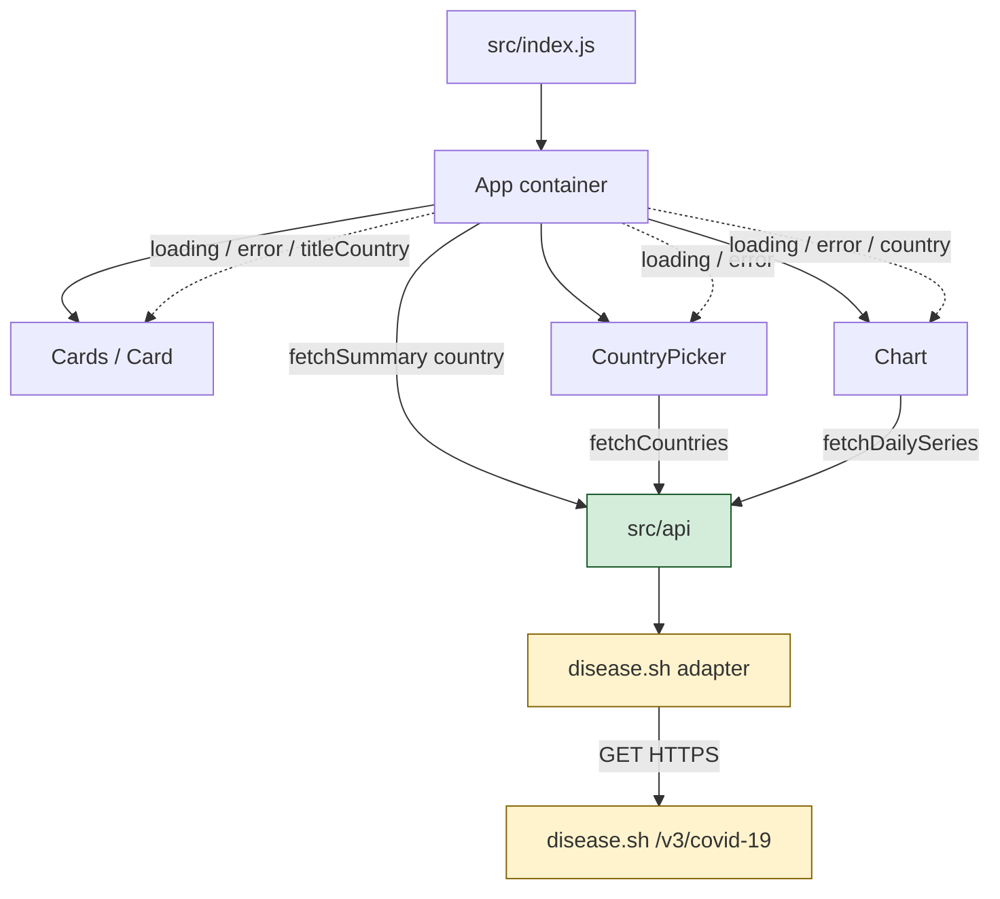
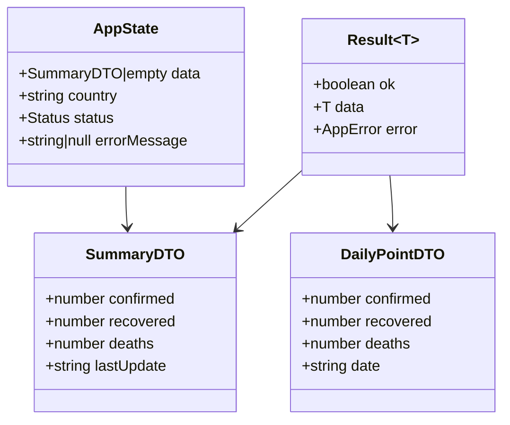

# Design Document — COVID-19 Tracker Stabilization & Hardening

**Run ID:** `20260720T182332_fr2tvm`  
**Agent:** design-doc-agent  
**Repo:** `arpitsaxena-gl/project_corona_tracker`  
**Base:** `master` @ `c6b004c2a7`  
**Sources:** `01-code-analysis.md`, `analysis_output.json`  
**Jira/ticket:** Not provided — N/A

---

## I. Executive Summary

Restore a working COVID-19 dashboard by replacing retired upstream APIs with a maintained provider behind an adapter, stop leaking Error objects into UI state, and close labeling / loading / dependency gaps identified by the Code Analyser — without changing product purpose or migrating off the existing React SPA stack.

| Item | Detail |
|------|--------|
| **Audience** | Frontend developers implementing the enhancement; Task List / Code Gen / Test agents consuming this doc |
| **Value** | App loads live (or last-known) COVID metrics again; no runtime crashes on failed fetch; correct Global vs country UX |
| **Success criteria** | (1) Summary + countries + daily series load from the new provider; (2) failed network never crashes `.map` / destructuring; (3) Cards title reflects selected country; (4) default picker option labeled Global; (5) axios upgraded; (6) loading/error UI visible; (7) mapper unit tests pass |
| **Detected stack** | JavaScript/JSX SPA: React 16.13 + CRA (`react-scripts` 3.4.1), Material-UI v4, Chart.js 2 / react-chartjs-2, axios 0.19.2, CSS Modules, Jest/Testing Library (declared, unused). **Confidence: high** (`analysis_output.json.detected_stack`) |
| **In scope** | API adapter + DTO/Result pattern, UX labeling fixes, App loading/error state, defensive guards, axios bump, minimal tests, env-based base URL |
| **Out of scope** | New backend/BFF, auth, DB, TypeScript rewrite, Vite migration in Phase 1 (planned as Phase 3), redesign of visual brand, non-COVID product features |

---

## II. System Architecture

### High-Level Diagram



*Highlighted = new/changed relative to current mathdro + covidtracking wiring.*

### Component Breakdown

| Component | Path | Responsibility | Inputs | Outputs / boundary |
|-----------|------|----------------|--------|---------------------|
| Bootstrap | `src/index.js` | Mount root | DOM `#root` | `<App />` |
| App (container) | `src/App.js` | Own `data`, `country`, `status` (`idle`\|`loading`\|`success`\|`error`); orchestrate fetch on mount + country change | User country selection | Props to Cards, CountryPicker, Chart |
| Cards | `src/components/Cards/Cards.jsx` | Render Infected / Recovered / Deaths cards | `data`, `titleScope`, `status` | Presentational only |
| Card | `src/components/Cards/Card/Card.jsx` | Single metric + CountUp | `cardTitle`, `value`, `lastUpdate`, `cardSubtitle`, `className` | Presentational |
| CountryPicker | `src/components/CountryPicker/CountryPicker.jsx` | Country NativeSelect | `handleCountryChange`, countries list + status | Calls callback with country string or `''` |
| Chart | `src/components/Chart/Chart.jsx` | Line (global daily) or Bar (country snapshot) | `data`, `country`, optional `dailyStatus` | Presentational + local daily fetch (retain pattern; harden) |
| API façade | `src/api/index.js` | Public `fetchData`, `fetchDailyData`, `fetchCountries` (keep export names for minimal churn) | `country?`, optional `AbortSignal` | `Result<T>` — never raw `Error` |
| Adapter | `src/api/adapters/diseaseSh.js` **(new)** | Map disease.sh JSON → internal DTOs | Raw axios responses | Normalized DTOs |
| Config | `src/api/config.js` **(new)** | Base URL from `REACT_APP_COVID_API_BASE` | Env | Constants |

**Rejected alternative:** Introduce a BFF / Node proxy — rejected; SPA-only stack has no server; adds ops cost without requirement.

**Rejected alternative:** Migrate to TypeScript in Phase 1 — deferred to Phase 3; JSDoc typedefs + tests deliver contracts faster.

### Sequence Diagrams

#### Primary: Load global summary on mount

```mermaid
sequenceDiagram
  participant App
  participant API as src/api
  participant Ad as diseaseSh adapter
  participant Ext as disease.sh

  App->>App: status = loading
  App->>API: fetchData()
  API->>Ad: getGlobalSummary()
  Ad->>Ext: GET /v3/covid-19/all
  alt HTTP 2xx + shape OK
    Ext-->>Ad: JSON
    Ad-->>API: SummaryDTO
    API-->>App: { ok: true, data: SummaryDTO }
    App->>App: status = success; set data
    App->>App: render Cards + Chart line path
  else HTTP error / network / bad shape
    Ext-->>Ad: error or invalid body
    Ad-->>API: fail
    API-->>App: { ok: false, error: AppError }
    App->>App: status = error; data stays {}
    App->>App: render error UI + Retry
  end
```

#### Primary: Country change → bar chart

```mermaid
sequenceDiagram
  participant CP as CountryPicker
  participant App
  participant API as src/api
  participant Ext as disease.sh

  CP->>App: handleCountryChange("India")
  App->>App: status = loading; country = "India"
  App->>API: fetchData("India")
  API->>Ext: GET /v3/covid-19/countries/India
  alt success
    Ext-->>API: country JSON
    API-->>App: { ok: true, data: SummaryDTO }
    App->>App: status = success
    App->>CP: (unchanged options)
    Note over App: Cards titleScope = "India"; Chart uses Bar
  else failure
    API-->>App: { ok: false, error }
    App->>App: status = error; keep prior data optional
  end
```

#### Alternate: Country list / daily series failure

```mermaid
sequenceDiagram
  participant CP as CountryPicker
  participant Chart
  participant API as src/api

  CP->>API: fetchCountries()
  API-->>CP: { ok: false, error }
  CP->>CP: countries = []; show inline error; no .map crash

  Chart->>API: fetchDailyData()
  API-->>Chart: { ok: false, error }
  Chart->>Chart: dailyData = []; show empty/error; no dailyData[0] on Error
```

### Cross-cutting Concerns

| Concern | Design |
|---------|--------|
| **Logging** | `console.error('[covid-api]', code, message)` in API layer only; no PII. Do not `console.log` raw payloads in production builds. |
| **Errors** | Normalize to `AppError { code, message, cause? }`. Codes: `NETWORK`, `HTTP_4XX`, `HTTP_5XX`, `INVALID_SHAPE`, `ABORTED`. |
| **Config** | `REACT_APP_COVID_API_BASE` default `https://disease.sh/v3/covid-19`. Document in `.env.example`. |
| **Cancellation** | Pass `AbortSignal` from `componentDidMount` / `useEffect` cleanup into axios `signal` (axios ≥0.22). |
| **Naming** | Keep public export names `fetchData` / `fetchDailyData` / `fetchCountries` for callers; internal adapter names may differ. |

---

## III. Data Model

No persistent store (SPA). Design centers on **in-memory DTOs** and React state.

### Entities (logical)



### Field Specification Table

| Field key | Location | Type | Size/format | Null? | Default | Mand/Opt | Classification | Validation notes |
|-----------|----------|------|-------------|-------|---------|----------|----------------|------------------|
| `country` | App state / `fetchData` arg | `string` | country name as returned by API | empty = global | `''` | Optional | Input / Conditional | Truthy → country endpoint; `encodeURIComponent` |
| `data.confirmed` | App / Cards / Chart | `number` (normalized) **or** legacy `{ value }` during transition | ≥0 integer | no on success | — | Mandatory on success | Business / Output | Adapter exposes both `.value` wrapper for Cards compatibility **or** Cards updated to number — **decide: keep `{ value }` shape** to minimize Cards/Chart churn |
| `data.recovered` | same | `{ value: number }` | ≥0 | no on success | — | Mandatory on success | Output | May be 0 if provider stops reporting recovered |
| `data.deaths` | same | `{ value: number }` | ≥0 | no on success | — | Mandatory on success | Output | |
| `data.lastUpdate` | same | ISO-8601 string | date | no on success | — | Mandatory on success | Output | From provider `updated` ms → `new Date(ms).toISOString()` |
| `status` | App **(new)** | enum string | `idle\|loading\|success\|error` | no | `idle` | Mandatory | Business | Drives UI gates |
| `errorMessage` | App **(new)** | string \| null | ≤500 chars | yes | `null` | Optional | Business | User-facing |
| `countries[]` | CountryPicker | `string[]` | names | no on success | `[]` | Mandatory when success | Output | `Array.isArray` guard before `.map` |
| `dailyData[]` | Chart | `DailyPointDTO[]` | chronological | no on success | `[]` | Mandatory when success | Output | `Array.isArray` + length check |
| `handleCountryChange` | CountryPicker prop | `function` | — | no | — | Mandatory | Input | Document; enable PropTypes |
| `cardTitle` / `value` / `lastUpdate` / `cardSubtitle` | Card | string / number / date / string | — | no when rendered | — | Mandatory when card shown | Input | Guard at Cards level |
| `titleScope` | Cards **(new)** | string | display label | no | `'Global'` | Mandatory | Business | From App `country \|\| 'Global'` |
| NativeSelect default | CountryPicker | `''` | — | — | `''` | Default | Input | Label **must** be `Global` (not United States) |

### Storage Strategy

| Topic | Decision | Rationale |
|-------|----------|-----------|
| Persistence | None (transient React state) | Matches existing SPA; no DB in stack |
| Caching | In-memory module cache for `countries` (session) optional Phase 2 | Reduces remount refetch; not P0 |
| Migration | N/A for schema; **API cutover** = swap base URL + mapper in one release | Rollback = revert env / redeploy prior commit |
| Indexing / partitioning | Not applicable — no local DB | — |

### Provider → DTO Mapping (disease.sh)

| Internal field | Global (`/all`) | Country (`/countries/{name}`) | Historical (`/historical/all?lastdays=120`) |
|----------------|-----------------|-------------------------------|---------------------------------------------|
| `confirmed.value` | `cases` | `cases` | timeline `cases[date]` |
| `recovered.value` | `recovered` | `recovered` | timeline `recovered[date]` (may be 0) |
| `deaths.value` | `deaths` | `deaths` | timeline `deaths[date]` |
| `lastUpdate` | `updated` (epoch ms) | `updated` | use point date string |
| countries list | — | `/countries` → `country` field | — |

**Assumption (A1):** disease.sh remains publicly reachable without API keys. If blocked, swap adapter only.

---

## IV. API / Interface Design

Client-side module contracts (not a public HTTP API). External HTTP is outbound-only.

### Internal Module Contracts

| Export | Signature | Success | Failure | Auth | Idempotent |
|--------|-----------|---------|---------|------|------------|
| `fetchData` | `(country?: string, opts?: { signal?: AbortSignal }) => Promise<Result<SummaryDTO>>` | `{ ok: true, data }` | `{ ok: false, error }` | none | yes (GET) |
| `fetchDailyData` | `(opts?: { signal?: AbortSignal }) => Promise<Result<DailyPointDTO[]>>` | `{ ok: true, data: [] }` | `{ ok: false, error }` | none | yes |
| `fetchCountries` | `(opts?: { signal?: AbortSignal }) => Promise<Result<string[]>>` | `{ ok: true, data: [] }` | `{ ok: false, error }` | none | yes |

`SummaryDTO` (wire-compatible with existing Cards/Chart):

```js
{
  confirmed: { value: number },
  recovered: { value: number },
  deaths: { value: number },
  lastUpdate: string // ISO
}
```

### External HTTP (adapter)

| Method | Path | Purpose | Content-Type |
|--------|------|---------|--------------|
| GET | `{BASE}/all` | Global summary | `application/json` |
| GET | `{BASE}/countries/{encodeURIComponent(name)}` | Country summary | `application/json` |
| GET | `{BASE}/countries` | Country list | `application/json` |
| GET | `{BASE}/historical/all?lastdays=120` | Global daily series | `application/json` |

**Rejected:** Keep covidtracking US daily — retired; mismatches "global" UX (analysis P1).

**Timeout:** axios `timeout: 15000`.

### Example Payloads

**Success `fetchData()`:**

```json
{
  "ok": true,
  "data": {
    "confirmed": { "value": 700000000 },
    "recovered": { "value": 0 },
    "deaths": { "value": 7000000 },
    "lastUpdate": "2026-07-20T12:00:00.000Z"
  }
}
```

**Failure:**

```json
{
  "ok": false,
  "error": {
    "code": "NETWORK",
    "message": "Unable to reach COVID data service. Check your connection and try again."
  }
}
```

### App / Component Prop Contracts (changed)

| Component | Prop changes |
|-----------|--------------|
| `Cards` | Add `titleScope: string`; Add `status: Status`; keep `data` |
| `Chart` | Treat `data` with optional chaining; handle `Result` from daily fetch internally |
| `CountryPicker` | Fix default option label; guard array; surface list error |
| `App` | Extend state; on Result branch set status/error; pass `titleScope={country \|\| 'Global'}` |

### Versioning / Backward Compatibility

- Keep export names and `SummaryDTO` `{ value }` shape so Cards/Chart need minimal edits.
- Callers must switch from `const data = await fetchData()` assuming payload **to** Result handling — **breaking for App/Chart/CountryPicker only** (all in-repo).
- No semver API; document in CHANGELOG note in PR body (PR Agent).

### Events

Not applicable — not event-driven.

---

## V. Business Logic & Validation Design

### Core Workflows

**W1 — Initial load**
1. Mount App → `status = loading`.
2. `fetchData()` + CountryPicker `fetchCountries()` + Chart `fetchDailyData()` (parallel, independent).
3. On summary success → `data`, `status = success`.
4. On summary failure → `status = error`, show message + Retry (re-call W1).
5. Countries/daily failures degrade locally (empty select / empty chart) without crashing App.

**W2 — Country select**
1. User picks option; value `''` = Global; else country name string.
2. `handleCountryChange(country)` → loading → `fetchData(country)`.
3. Update `data`, `country`, `status`.
4. Cards `titleScope` = `country || 'Global'`.
5. Chart: falsy country → line (global historical); truthy → bar (snapshot from `data`).

**W3 — Retry**
1. Retry button sets loading and re-invokes last fetch scope (global or current country).

### Validation Matrix

| Field / input | Input validation | Business validation | Database | Conditional | Error behavior | Gap closed |
|---------------|------------------|---------------------|----------|-------------|----------------|------------|
| `country` | string; empty allowed | if non-empty, path-encode; optionally allow-list against fetched countries | N/A | switches URL + chart mode | invalid → still attempt encode; 404 → `HTTP_4XX` message | encodeURIComponent; no raw Error |
| `confirmed` | N/A (API) | must be number ≥0 after map; presence before Cards metrics | N/A | Cards render when `status===success` && confirmed defined | if missing shape → `INVALID_SHAPE` | success-shape check in adapter |
| `dailyData` | N/A | `Array.isArray` && length > 0 for line chart | N/A | only when `!country` | empty → null chart + message | never index Error |
| `countries` | N/A | `Array.isArray` before `.map` | N/A | — | error UI; keys = country name | crash gap |
| `data` prop to Chart | object | optional chain `data?.confirmed?.value` | N/A | bar when country set | no throw | destructure crash gap |
| Cards loading gate | — | distinguish `loading` vs `error` vs `success` | N/A | — | Loading spinner / Error / Cards | conflated Loading… gap |
| Default select | value `''` | label `Global` | N/A | — | — | United States mislabel |
| Cards title | — | `titleScope` from App | N/A | — | — | always "Global" gap |

### Error Model

```js
// Uniform Result
{ ok: true, data: T } | { ok: false, error: { code: string, message: string } }
```

| Layer | Behavior |
|-------|----------|
| Adapter | Throw/return only via façade; validate required numeric fields |
| API façade | Catch axios errors → map status to code; never `return error` |
| App | Store `errorMessage`; do not store Error in `data` |
| UI | Render message; Retry; keep layout stable |

---

## VI. Infrastructure & DevOps

| Topic | Design |
|-------|--------|
| **Deploy target** | Static SPA (CRA `build/` → any static host: GitHub Pages, Netlify, S3+CloudFront). Unchanged model. |
| **Environments** | `development` (CRA start), `production` build. Optional `REACT_APP_COVID_API_BASE` per env. |
| **CI/CD** | Add GitHub Actions workflow (Phase 2): `npm ci` → `npm test -- --watchAll=false` → `npm run build`. None exists today (analysis). |
| **Secrets** | No API keys required for disease.sh. Do not commit `.env` with secrets. `.env.example` only. |
| **Observability** | Browser console errors with codes; optional later: report Web Vitals. No server metrics. |
| **Health** | N/A server health. Client: Retry UI acts as user-facing health. |

**Phase 1 vs Phase 3 toolchain:** Phase 1 stays on CRA; Phase 3 (upgrade) moves to React 18 + Vite or CRA5 and MUI v5 — designed separately in §VIII so Task agent can phase it.

---

## VII. Security & Compliance

| Finding (analysis) | Design response |
|--------------------|-----------------|
| axios ^0.19.2 vulnerable | **Phase 1:** bump to `axios@^1.7` (or latest 1.x); use `signal` + `timeout` |
| react-scripts 3.4 / React 16 EOL | **Phase 3:** upgrade React 18 + modern bundler; not blocking P0 data fix |
| MUI v4 EOL | **Phase 3:** MUI v5 with `@mui/material` + emotion |
| Unencoded country path | `encodeURIComponent(country)` in adapter |
| No secrets in source | Keep; only public GETs |
| a11y rules disabled | Phase 2: re-enable `jsx-a11y/alt-text`, `click-events-have-key-events` incrementally; CountryPicker: associate label with select |

**AuthZ:** Not applicable — public read-only dashboard.

**Data protection:** HTTPS to disease.sh (browser default). No PII collected. No audit log requirement identified.

**Input sanitization:** Country strings only used in URL path (encoded) and React text children (default escaping). Do not use `dangerouslySetInnerHTML`.

---

## VIII. Enhancement / Implementation Strategy

### Impact Analysis

| Dimension | Impact |
|-----------|--------|
| **Business** | Restores primary value (view COVID stats by country); corrects misleading Global/US labels |
| **Technical** | Touches `src/api/*`, `App.js`, Cards, Chart, CountryPicker, `package.json`; new adapter + config files |
| **Risk** | Provider field differences (recovered often 0); historical endpoint shape differs from covidtracking — mapper must be tested |
| **Blast radius** | All UI surfaces that consume API; no external API consumers (SPA-only) |

### Ordered Minimal Steps (Task-List ready)

| Step | Phase | Work | Closes | Depends on |
|------|-------|------|--------|------------|
| 1 | P0 | Add `src/api/config.js` + `.env.example` with `REACT_APP_COVID_API_BASE` | Hard-coded URL coupling | — |
| 2 | P0 | Add `src/api/adapters/diseaseSh.js` mappers (summary, countries, historical→daily) | Dead mathdro/covidtracking | 1 |
| 3 | P0 | Rewrite `src/api/index.js` to Result pattern + axios timeout/signal; remove `return error` | Error-as-data crashes | 2 |
| 4 | P0 | Update App to handle Result; add `status` / `errorMessage`; Retry | Loading/error UX (partial) | 3 |
| 5 | P0 | Guard CountryPicker `Array.isArray`; fix default label to Global; key=name | `.map` crash; US mislabel | 3 |
| 6 | P0 | Guard Chart optional chaining + array checks; switch daily to historical/all | Destructure crash; US-as-global chart | 3 |
| 7 | P1 | Pass `titleScope` into Cards; stop hard-coded "Global" | Cards title bug | 4 |
| 8 | P1 | Bump axios to 1.x; fix imports if needed | Security finding axios | 3 |
| 9 | P1 | Explicit loading/error UI components (simple CSS, no new UI lib) | P2 loading UX | 4–7 |
| 10 | P2 | Unit tests: adapter mappers + Result failure paths (Jest) | No tests gap | 2–3 |
| 11 | P2 | PropTypes for Card, Cards, Chart, CountryPicker | PropTypes disabled | 7 |
| 12 | P3 | React 18 + toolchain + MUI v5 + Chart.js 3 upgrade spike | EOL deps | 8–11 stable |
| 13 | P3 | AbortController on all effects; session cache for countries | Perf findings | 3 |

**Scope boundary:** Enhance within React/CRA/JS stack. Do **not** rewrite in another language/framework.

### Recommended Provider Choice

| Option | Pros | Cons | Verdict |
|--------|------|------|---------|-----|
| **disease.sh** | Maintained, CORS-friendly, country + historical, no key | Recovered may be stale/0; community-run | **Select** |
| Our World in Data CSV | Authoritative | Needs parse/hosting; heavier | Reject for SPA simplicity |
| WHO API | Official | Auth/CORS/complexity | Reject for this app size |

---

## IX. Traceability

| Design decision | Source |
|-----------------|--------|
| Stay on React SPA; no backend | `analysis_output.json.detected_stack`, architecture.style |
| Replace mathdro + covidtracking with adapter | issues[0], integration_points, recommendations[0] P0 |
| Choose disease.sh + env base URL | recommendations[0]; §VIII provider table |
| `Result` / never return Error as data | issues[1], performance_findings[2], recommendations[1] P0 |
| `Array.isArray` + optional chaining guards | issues[2], issues[3], field_validations.general dailyData |
| App `status` loading/error/success | recommendations[2]; validation business confirmed conflation |
| Default option label Global; value `''` | issues[4]; field_validations.default NativeSelect |
| Cards `titleScope` from country | issues[5]; recommendations[3] |
| Global historical for line chart | integration_points covidtracking notes; recommendations[3] |
| axios upgrade Phase 1 | security_findings[0]; recommendations[4] partial |
| React/MUI/CRA upgrade Phase 3 | security_findings[1–2]; recommendations[4] |
| encodeURIComponent country | security_findings[3] |
| Jest tests for mappers | issues[6]; recommendations[5] |
| AbortSignal cancellation | performance_findings[0]; recommendations[6] |
| Keep `{ confirmed: { value } }` DTO | Existing Cards/Chart contracts (`src/components/Cards`, `Chart.jsx`) |
| Field classifications carried forward | `validation_classifications` + §4 Inputs in `01-code-analysis.md` |
| Jira key | Not in inputs — N/A |

---

## X. Open Questions & Risks

| ID | Item | Type | Mitigation | Owner / decision needed |
|----|------|------|------------|-------------------------|
| A1 | disease.sh availability / ToS / rate limits not verified in this run | Assumption | Adapter isolation; document fallback provider swap | Implementer verify before merge |
| A2 | `recovered` often 0 on modern feeds — UX may look "wrong" | Risk | Subtitle: "Recovered (as reported by source)"; allow 0 | Product/dev confirm copy |
| A3 | Historical `lastdays=120` vs full series — performance vs completeness | Assumption | Start 120; make env `REACT_APP_COVID_HISTORY_DAYS` | Design default 120 unless contradicted |
| A4 | No Jira ticket in pipeline context | Ambiguity | Traceability uses analysis keys; PR Agent links later | Orchestration |
| R1 | Axios 1.x may need minor call-site changes | Risk | Step 8 isolated; run build after bump | Code Gen |
| R2 | Phase 3 MUI upgrade large blast radius | Risk | Defer until P0/P1 green; separate PR | Team |
| R3 | Country name mismatch (e.g. "USA" vs "US") between list and path | Risk | Use exact `country` string from `/countries` list only | CountryPicker only emits list values |
| R4 | Class App + hooks children inconsistency | Smell (info) | Optional convert App to function component in Phase 2 | Not required for P0 |

---

## Pipeline Handoff

| Item | Value |
|------|-------|
| **Feature branch** | `feature/design-doc-20260720-fr2tvm` |
| **Artifact** | `agent-runs/20260720T182332_fr2tvm/02-design-document.md` |
| **PR** | Not created — **pr-creator-agent** will open the pull request |
| **Base** | `master` |
| **Next agents** | Task List / Jira Spec / Code Gen / Test — consume this file + `01-code-analysis.md` / `analysis_output.json` |
